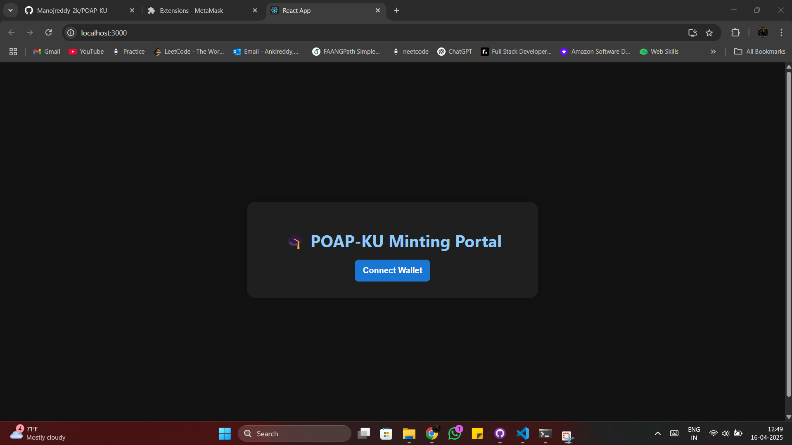
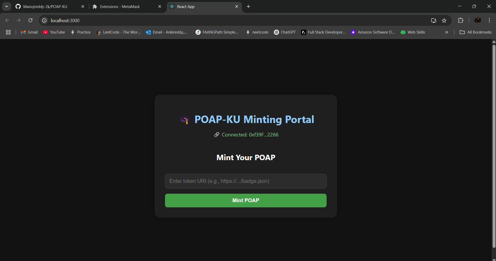
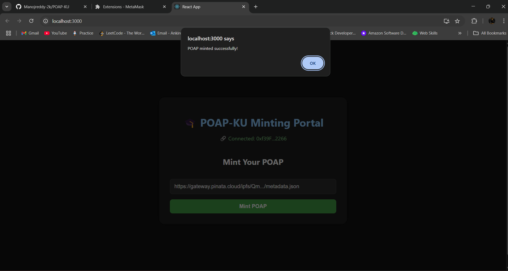
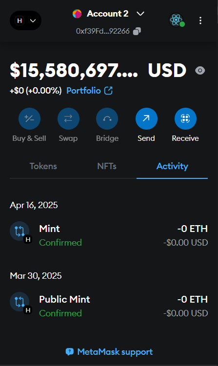
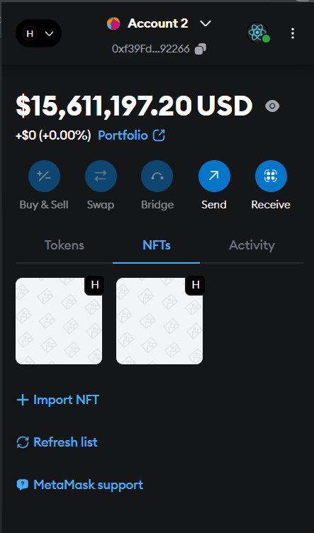

# 🎓 POAP-KU: Soulbound NFT Attendance Badge DApp

POAP-KU is a decentralized application built using **React**, **Solidity**, **Ethers.js**, and **Hardhat**. It enables users to mint **Soulbound NFTs** (non-transferable tokens) as **Proof of Attendance** for university or community events.

---

## 🚀 Features

- 🎯 **One-Time Minting**: Users can mint only once using the `publicMint` function.
- 🔒 **Soulbound NFTs**: Minted NFTs cannot be transferred.
- 🧠 **Smart Contract Validations**: Prevents duplicate minting and empty tokenURIs.
- 💾 **IPFS Storage**: Metadata and badge images are stored on **Pinata (IPFS)**.
- 🦊 **MetaMask Integration**: Connects wallet via MetaMask.

---

## 📂 Project Structure
```
POAP-KU/
├── poap-ku-backend/
│   ├── contracts/
│   │   └── POAPKU.sol
│   ├── scripts/
│   │   ├── deploy.js
│   │   └── interact.js
│   └── hardhat.config.js
│
├── poap-ku-frontend/
│   ├── src/
│   │   ├── App.js
│   │   ├── App.css
│   │   └── index.js
│   └── package.json
│
├── images/
│   ├── block1.1.png
│   ├── block1.2.png
│   ├── block1.3.png
│   ├── block2.1.png
│   └── block3.1.png
├── README.md
└── .gitignore
```

---

## 🧪 Smart Contract
**File:** `POAPKU.sol`
**Type:** ERC721URIStorage + Ownable

### Key Functions
- `function publicMint(string memory tokenURI)`: Publicly mint the badge.
- `function hasMinted(address user)`: View if a user has minted.
- Soulbound logic implemented via `_update` override (only mint/burn allowed).

### Contract Address (Localhost)
```
0x5FbDB2315678afecb367f032d93F642f64180aa3
```

---

## 🎨 Screenshots

### 1. Wallet Connected + UI



### 2. Token URI Input & Mint


### 3. Mint Confirmed


### 4. MetaMask Activity


### 5. NFTs in MetaMask


---

## 📁 IPFS Metadata
- 🖼️ Image: `https://gateway.pinata.cloud/ipfs/bafkreidnomvtnubvcdlemtikzgvytvphce5d2ka726yh3cy2c2c3qw3ara`
- 🗂️ Metadata URI Example: `https://gateway.pinata.cloud/ipfs/<your-metadata-hash>.json`

**Note:** Paste this metadata URI in the input box on the app.

---

## 🛠️ Getting Started

### 🧪 Backend (Hardhat)
```bash
cd poap-ku-backend
npm install
npx hardhat node
npx hardhat run scripts/deploy.js --network localhost
```

### 🌐 Frontend (React)
```bash
cd ../poap-ku-frontend
npm install
npm start
```

---

## 🧠 Tech Stack
- **Solidity** – Smart Contracts (ERC721)
- **React** – Frontend UI
- **Ethers.js** – Blockchain interaction
- **Hardhat** – Local blockchain dev
- **Pinata (IPFS)** – Decentralized storage for metadata and images
- **MetaMask** – Wallet connection

---

## 📜 License
MIT License

---

## 🤝 Acknowledgements
- [OpenZeppelin Contracts](https://github.com/OpenZeppelin/openzeppelin-contracts)
- [Hardhat](https://hardhat.org)
- [Pinata](https://pinata.cloud)
- [MetaMask](https://metamask.io)

---

## 🙋‍♂️ Author
**Manoj Prakash Reddy Ankireddy**

> Feel free to ⭐ the repo if you liked the project!

